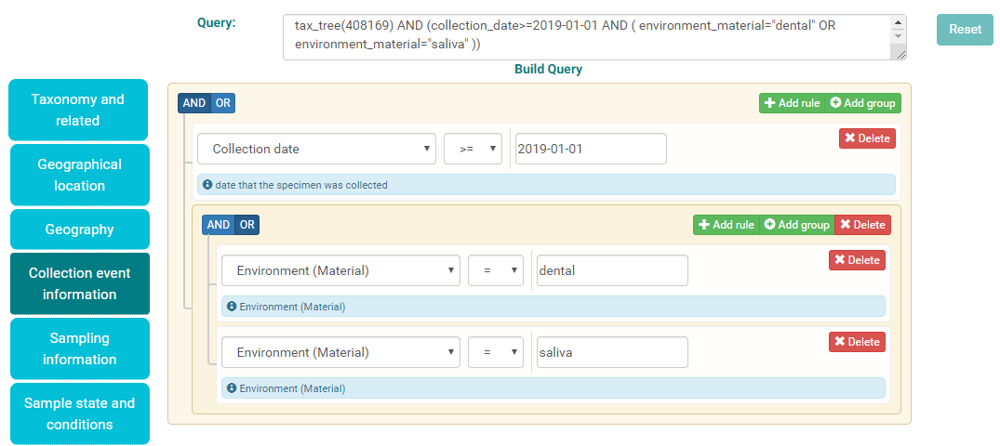

# Advanced Search

## Introduction

The ENA advanced search can be used to customise a search query and 
retreive a set of ENA records that fit the described search criteria.

All searches are done against a subset of the archive specified by 
their **datatype**. You can then build your custom search query, include 
or exclude any specific datasets that are wanted/unwanted within the results 
as well as specify the metadata fields you want the query to return.

If you wish to repeat the same search at a later date, you can save this 
as a Rule using [RuleSpace](https://www.ebi.ac.uk/ena/browser/rulespace).

## Data Types

Each data type is a subset of the data and metadata held within the ENA 
(e.g. the read_study datatype contains all studies that hold raw reads).

You must specify which datatype you wish to search across before you can 
narrow down your search results with any additional criteria. Hover over 
the data type options for more information on what each data type holds.

## Search Query

To build a query you need to create a list of rules that the resulting 
data sets should be restricted to.

This is done by clicking any relevant metadata types you would like to 
restrict (listed as buttons on the left) then selecting the relevant filters 
and specifying the desired restrictions for those:

When specifying taxonomy in your search, you can include all subordinate taxa 
within that tax tree and when searching by geographical range you can 
interactively drag the box or circle over the desired region to autofill 
the location range.

These rules can be grouped and nested within AND or OR logical statements. 
For example, a query for all metagenomic analyses where the sample was 
collected after 01 Jan 2019 and the environmental material is either dental or 
saliva would look as follows:

## Inclusion/Exclusion of datasets

If there are any known public datasets that do or do not fit the criteria 
you have specified that you wish to include or exclude from the results, 
you can list the accessions in a comma separated list here (with no spaces).

## Return Fields

By default, you will receive the accession and description/title
of the main datatype you are searching against. If you wish to customise the 
metadata which your search will return, you can manually select your search 
return fields from a list of all indexed fields for the specified datatype.

To select fields you would like returned from your search, drag across any 
desired fields from the **Available Fields** list to the **Selected Fields** 
list. Alternatively, use the arrow buttons in the middle to move fields across 
from one list to the other.

The order of the **Selected Fields** list will define the order that you 
receive those metadata from your search. To specify the return order of these 
fields, you can drag and drop these into the desired order.

In some cases, a 'field set' will be available. This is a pre-defined set of 
fields that can be returned together. For example, for the analysis datatype, 
you can toggle the 'Submitted Files' field set which can be used to return 
all relavent fields relating to the original set of submitted files (e.g. 
this set includes the aspera, ftp and galaxy links for the submitted files, 
the size of the files (in bytes) and the files' md5 checksums).

## Data Filters

You can specify a data limit for the maximum number of records you would like 
to retrieve from your search (up to a maximum of 100 000).

If you wish to fetch the full result set, leave this field blank or enter '0'. 
The browser table display will only show up to 100 000 results but for large 
datasets, you can see all results if you download the report or copy and run 
the curl request.

## Download results

### XML

Download all the resulting ENA metadata objects in XML format.

This will download **all** the metadata for each object in the standard ENA XML 
format (used for data submission and for data to be rendered in the browser). 
If you wish to only download the fields returned that were specified in your 
search, use one of the **Download report** options (JSON or TSV).

### JSON

Download all the specified fields returned from your search in the format 
of a JSON file.

### TSV

Download all the specified fields returned from your search in the format 
of a TSV file.
